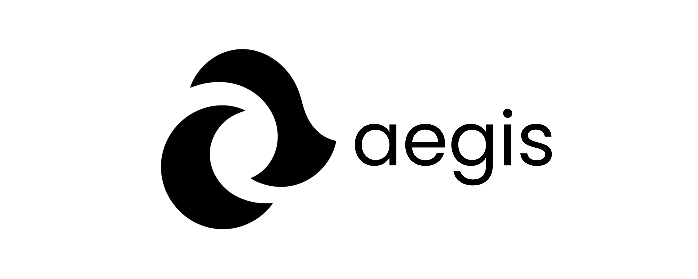

  <picture>
    <source media="(prefers-color-scheme: dark)" srcset="aegis-dark.png">
    <source media="(prefers-color-scheme: light)" srcset="aegis-light.png">
    
  </picture>

  <em><b>Aegis</b> – Full-stack Instagram clone with React + ExpressJS + PostgreSQL + TailwindCSS</em>

  <em>By Miguel R. Buccat (AKA lumi-dev)</em>

  <a href="#">Live Demo</a> |
  <a href="#">OpenAPI Documentation</a> |
  <a href="https://github.com/lumi-png/aegis">Source code</a>

---

## Table of Contents

- [Prerequisites](#prerequisites)
- [Deployment](#deployment)
    - [Production](#production)
    - [Development](#development)
        - [Prerequisites](#prerequisites)
- [Architecture](#architecture)
- [License](#license)

---

## Deployment

### Production

### Development

#### Prerequisites

Before you begin, ensure you have the following:

- **Node.js** (v24) - [Download](https://nodejs.org/)
- **npm** - Package manager
- **Docker** & **Docker Compose**  [Download](https://www.docker.com/)

## Architecture

## License

This project is licensed under the MIT License - see the [LICENSE](LICENSE) file for details.
